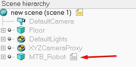

# Importancia de la programacion
Contenido inspirado por @cabustillo13 y su charla en Flisol
https://github.com/cabustillo13/CoppeliaSim_FlisolBA


## Requisitos
Tener instalado
 * [Coppelia Sim](https://www.coppeliarobotics.com/downloads)
 * [Python](https://www.python.org/)


## Ruta para los archivos de Copelia SIM
Ruta de archivos `sim.py` y `simConst.py`, ir a la carpeta de isntalacion y luego:
```
/CoppeliaRobotics/CoppeliaSimEdu/programming/remoteApiBindings/python/python
```

Ruta de librerias especificas de sistema operativo, entrar a su sistema operativo y luego copiar el arhchivo con nombre remoteApi
```
/CoppeliaRobotics/CoppeliaSimEdu/programming/remoteApiBindings/lib/lib
```

## Configurar Escenario
1. Abrir CoppeliaSim
2. Crear Escenario
3. Buscar en robots/non-mobile el robot `MTB robot.ttm`
4. Arrarstrar el robot `MTB robot.ttm` al escenario
5. Darle doble click al papel al par del MTB_Robot en la seccion `Scene Hierarchy`



6. Borrar todo el codigo
7. Copiar el codigo de [`robot_script.lua`](robot_script.lua) de este repositorio al robot
8. Guardar la escena en esta carpeta
9. Prueba mover el robot desde [python](hello_world.py)!


## Correr web server

```sh
# Linux/Mac Os
export FLASK_APP=web_server/app.py

# Windows CMD
set FLASK_APP=web_server/app.py
# Windows Powershell
$env:FLASK_APP = "web_server/app.py"
```